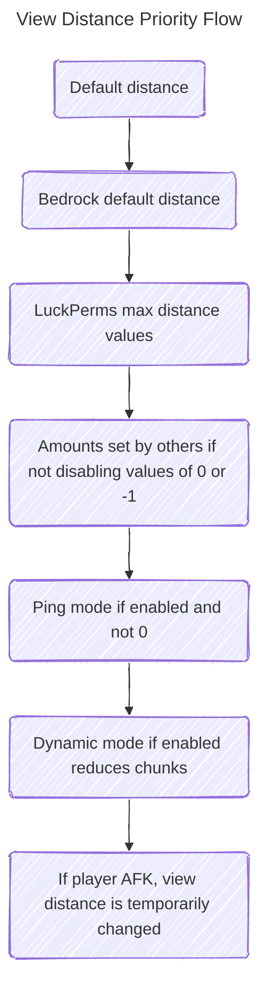

# Priority System

:::info[Edge Cases]
There are lots of edge cases in the priority system, so if you see something not working as expected, please let me know on **[Discord](https://discord.gg/akbd8EPSgr)** or **[GitHub Issues](https://github.com/Wyzebb/PlayerViewDistanceController/issues)**
:::

The priority system is at the core of how PVDC works. The diagram below should help you understand the order of priority for the plugin when deciding what view distance to set. Every value is clamped between the minimum and maximum values in **[config.yml](../config/config.yml.md)**.

#### **These diagrams may help, but don't include AFK, dynamic mode and ping mode**

